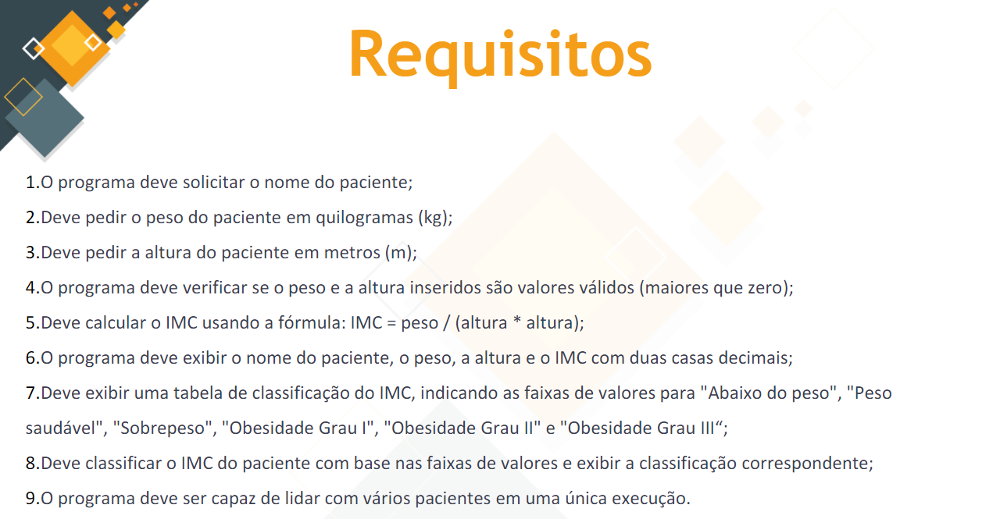
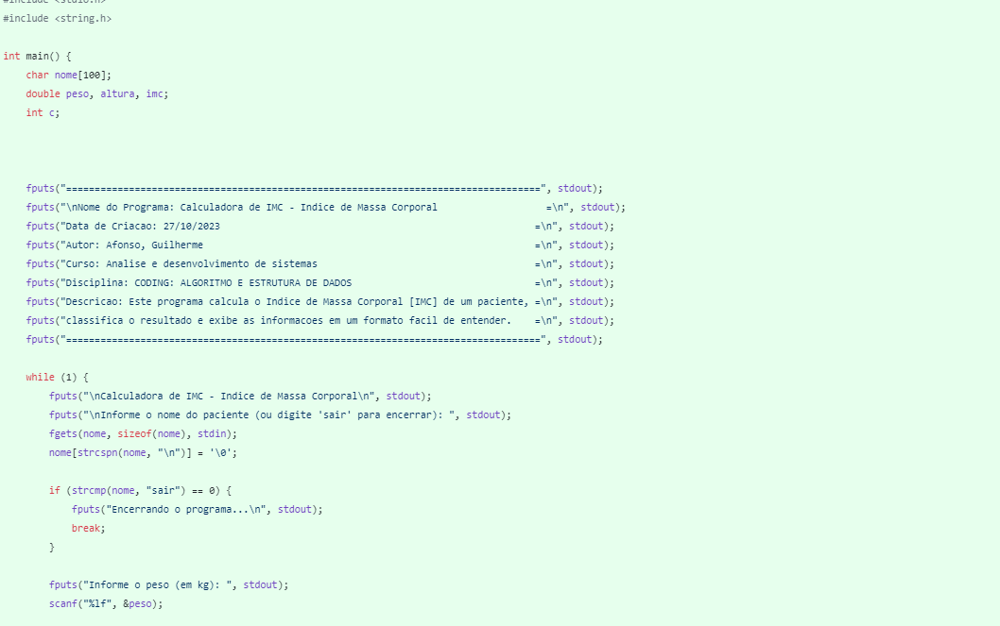

# Calculadora IMC 2023
### Mini Projeto 02

## Descrição

Você foi designado para desenvolver um programa em C que calcula o Índice de Massa Corporal(IMC) de um paciente,classifica o resultado e exibe as informações em um formato fácil de entender. O IMC é uma medida comum utilizada para avaliar se uma pessoa está acima do peso,com peso saudável ou abaixo do peso.

## Requisitos

## Tela
